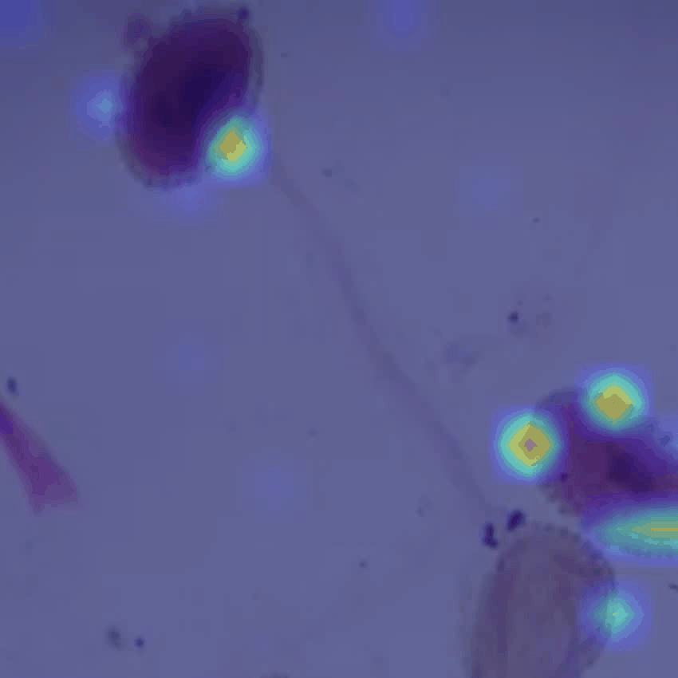
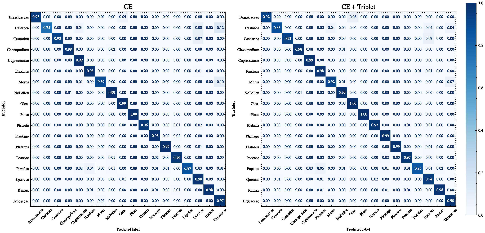
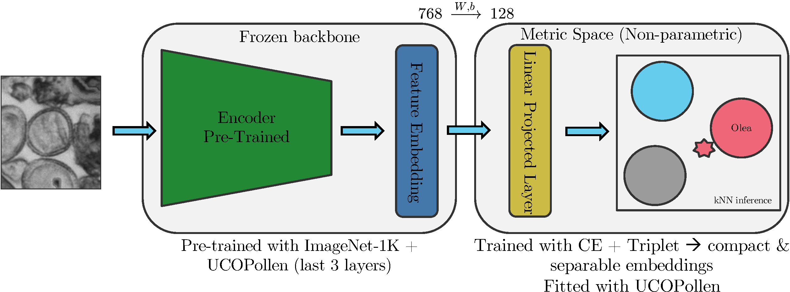
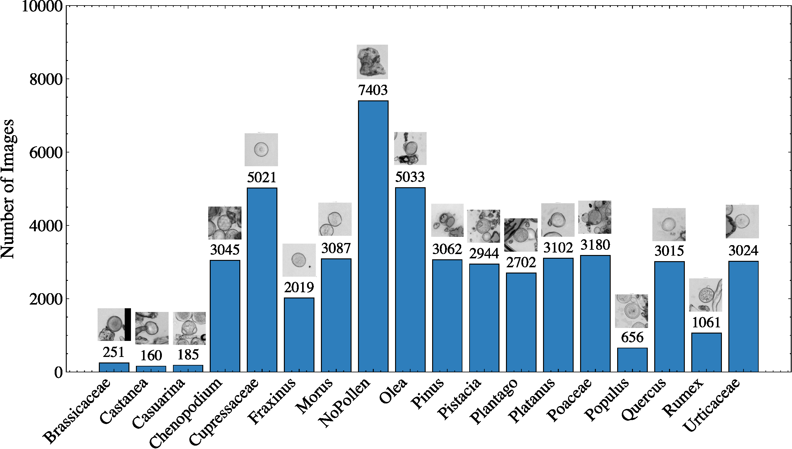
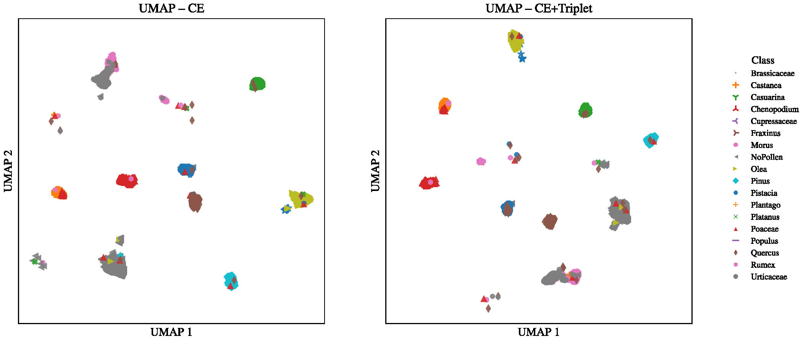
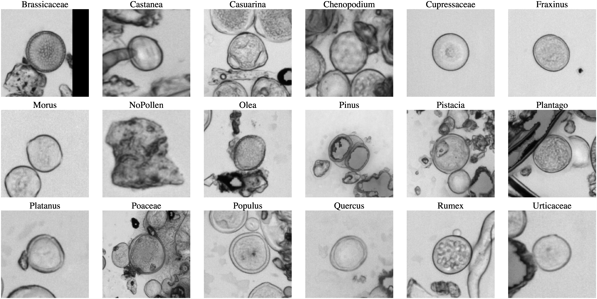

<div align="center">

# 🌾 PollenFormerUCO

### Vision Transformers for Pollen Grain Classification
#### A systematic backbone benchmark on **UCOPollen**

[](https://richardesp-pollenformer-uco-demo.hf.space/)
[](#-citation)
[](#-license)


<br/>

<a href="https://richardesp-pollenformer-uco-demo.hf.space/">
  
</a>

<br/><br/>



<sub><b>PollenFormerUCO</b> attends to biologically relevant regions — the <i>exine</i> and ornamentation patterns.<br/>Last-layer self-attention, head&nbsp;7.</sub>

</div>

---

## 🔬 Reviewers — start here

This repository accompanies the manuscript *“Vision Transformers for Pollen Grains Classification:
A Systematic Backbone Benchmark on UCOPollen”* (under review). To make the work easy to assess, a
**fully interactive live demo of the trained model is already online** — no installation, no setup:

<div align="center">

### 👉 **[richardesp-pollenformer-uco-demo.hf.space](https://richardesp-pollenformer-uco-demo.hf.space/)**

</div>

In the demo you can:

- 🖼️ **Upload a microscopy image** (JPG / PNG / WEBP / BMP) or pick a bundled sample.
- 🏷️ Get the **predicted pollen taxon** with a confidence indicator.
- 🤝 Inspect the **top-k nearest neighbours** (with cosine similarity) used for k-NN inference.
- 🔥 Overlay the model's **attention map** to see *which* morphological regions drove the decision.
- 🗺️ Explore the learned **embedding space** via a 2-D projection of the gallery.

> 📦 **Code and trained weights will be released upon publication.** This page and the live demo are
> available now so reviewers can evaluate the model's behaviour end-to-end.

---

## 🧩 TL;DR

- **Problem.** Automatic pollen identification underpins aerobiology, environmental monitoring, and
  allergy forecasting — but manual microscopy is slow and error-prone.
- **Method.** We benchmark several **Vision Transformer** backbones against a CNN baseline under
  identical training. The best model, **PollenFormerUCO** (DINOv2-ViT-B), is fine-tuned with a
  **hybrid Cross-Entropy + Triplet** objective that projects the CLS token into a compact **128-D
  embedding**, classified either by a **softmax head** or by **k-nearest-neighbours**.
- **Results.** **97.7% test accuracy / 96.7% macro-F1** (1-NN on 128-D), **97.4% / 96.6%** (softmax)
  across **17 pollen taxa + a NoPollen class**.
- **Why it matters.** Metric learning yields compact, well-separated embeddings on which simple,
  non-parametric k-NN generalizes to held-out data **without retraining**, and attention maps confirm
  the model focuses on biologically meaningful structures.

<details>
<summary><b>📄 Read the full abstract</b></summary>

> Automatic identification of pollen grains is essential for applications in aerobiology,
> environmental monitoring, and allergy forecasting. Traditional microscopic analysis is
> labor-intensive and prone to human error, while recent advances in Deep Learning have shown strong
> potential for reliable pollen recognition. In this study, several Vision Transformer (ViT)
> architectures are evaluated on a large curated data set from the University of Córdoba (UCO)
> comprising 48,950 images from 17 pollen taxa and one negative class (NoPollen). Beyond standard
> classification with Cross-Entropy, a hybrid loss function combining Cross-Entropy and Triplet loss
> is introduced to encourage compact and discriminative feature embeddings. The best model,
> PollenFormerUCO, based on a DINOv2-ViT Base backbone, achieved 97.4% test accuracy and a macro-F1
> of 96.6% with the softmax head, and 97.7% test accuracy and a macro-F1 of 96.7% via inference k
> closest neighbor on a compact 128-dimensional embedding. In particular, even lightweight ViT
> architectures (e.g., MobileViT) surpassed a ResNet18 baseline with half the size, confirming that
> Vision Transformers provide more discriminative representations for pollen morphology under
> identical training conditions. Beyond closed-set classification, the hybrid objective structured
> embeddings into a compact and well-separated low-dimensional space, where simple non-parametric
> algorithms such as k-nearest neighbors (k-NN) generalized to the held-out test set without
> retraining. Attention maps further confirmed that PollenFormerUCO focuses on biologically relevant
> regions such as the exine and ornamentation patterns. These results show that Vision Transformers,
> combined with metric learning, provide a powerful framework for pollen classification and support
> future transfer of these capabilities to smaller models with reduced computational requirements.

</details>

---

## ✨ Results at a glance

**PollenFormerUCO** — test-set generalization (UCOPollen v1.0):

| Inference method | Test Accuracy | Macro-F1 |
|---|:---:|:---:|
| Softmax head | 97.4% | 96.6% |
| **1-NN (128-D embedding)** | **97.7%** | **96.7%** |

- 🏆 **Transformers beat the CNN baseline.** Every ViT backbone outperformed a ResNet18 under
  identical training conditions.
- 🪶 **Efficiency.** Even a lightweight **MobileViT-S** surpassed ResNet18 at roughly **half the size**.
- 🧲 **Structured embeddings.** The hybrid objective produces compact, well-separated clusters, so
  non-parametric **k-NN generalizes without retraining**.

<div align="center">
<br/>
<sub>Confusion matrices on the held-out set — Cross-Entropy (left) vs. hybrid CE + Triplet (right).</sub>
</div>

---

## 🧠 Method & architecture

PollenFormerUCO pairs a self-supervised **DINOv2-ViT Base** backbone with a lightweight linear
projection (768 → **128-D**) trained under a **hybrid Cross-Entropy + Triplet** objective. At
inference, a query embedding is classified either by the **softmax head** or by **cosine k-NN** over
a gallery of training embeddings — the latter requires no extra training and exposes interpretable
nearest neighbours.

<div align="center">

</div>

---

## 📊 Dataset — UCOPollen v1.0

A large, curated collection of **48,950** microscopy images spanning **17 pollen taxa** plus a
**NoPollen** negative class, split in a stratified **70 / 15 / 15** train / val / test partition.

<div align="center">

</div>

<div align="center">

| | | | | | |
|---|---|---|---|---|---|
| Brassicaceae | Castanea | Casuarina | Chenopodium | Cupressaceae | Fraxinus |
| Morus | Olea | Pinus | Pistacia | Plantago | Platanus |
| Poaceae | Populus | Quercus | Rumex | Urticaceae | *NoPollen* |

</div>

> 🔒 The UCOPollen dataset is **not publicly released at this stage**.

---

## 🔍 Explainability

The hybrid objective reshapes the feature space into compact, well-separated clusters. The UMAP
projections below contrast the embeddings learned with plain Cross-Entropy versus the hybrid
CE + Triplet objective; the class-centroid view summarizes inter-class separation.

<div align="center">
<br/>
<sub>UMAP of validation embeddings — Cross-Entropy (left) vs. hybrid CE + Triplet (right).</sub>
<br/><br/>
<br/>
<sub>Class-centroid structure in the learned 128-D embedding space.</sub>
</div>

Attention maps (see the animation at the top) further confirm that PollenFormerUCO concentrates on
biologically meaningful structures such as the **exine** and surface **ornamentation**.

---

## 📦 Code & weights

Training code, environment specifications, and trained model weights will be released in this
repository **upon publication**, to support full reproducibility of the experiments. Until then, the
**[live demo](https://richardesp-pollenformer-uco-demo.hf.space/)** lets you exercise the trained
model directly in the browser.

---

## 📚 Citation

> The author list and venue are withheld during peer review and will be completed upon acceptance.

```bibtex
@unpublished{pollenformeruco2026,
  title  = {Vision Transformers for Pollen Grains Classification:
            A Systematic Backbone Benchmark on UCOPollen},
  author = {Author names withheld for peer review},
  year   = {2026},
  note   = {Manuscript under review. Full author list and venue added upon acceptance.}
}
```

---

## 👥 Authors

Author and affiliation details are **withheld during peer review** and will be added upon acceptance.

---

## 📄 License

Released under the **MIT License**. A `LICENSE` file will accompany the code release.
